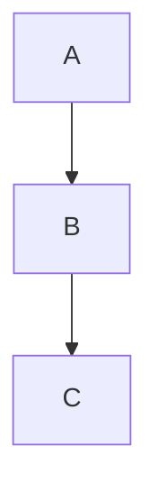

# {{Project Name}}

## 📝 Overview
Brief description of the project, what it solves, why it's important.

## 🎯 Goals
- [ ] Goal 1
- [ ] Goal 2
- [ ] Goal 3

## 🧠 Key Decisions
- Week [[2025-W10]] — {{Decision made}}.
- Week [[2025-W08]] — {{Another decision}}.

## 🔄 Open Questions
- {{Question 1}}
- {{Question 2}}

## 🛠️ Designs & Proposals
- [Link to design document](https://)
- Diagrams:

## 🐞 Known Issues
- {{Issue 1}}
- {{Issue 2}}

## 🔗 Related Notes
- [[Performance Improvements]]
- [[Incident Response Improvements]]
